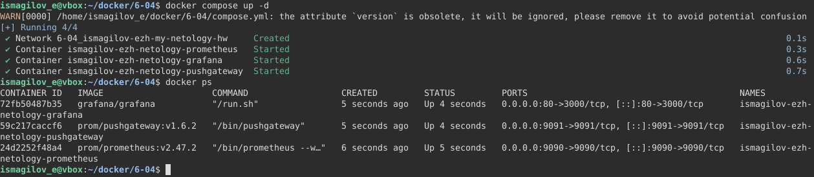
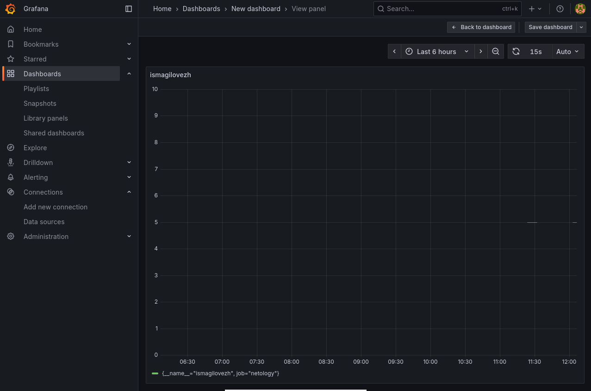
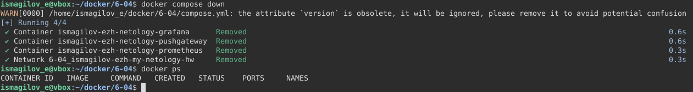

# Домашнее задание к занятию "`Docker. Часть 2`" - `Исмагилов Эжен`

### Задание 1

Установил Docker Compose командой:
```bash
sudo apt install docker-compose-plugin
```

Docker Compose позволяет легко запускать сразу несколько контейнеров с нужными параметрами, просто описав их в одном файле. Для меня это может сэкономить кучу времени, упрощает настройку окружения и делает работу с проектами более стабильной. Особенно это полезно для мониторинга или тестирования сложных систем.

---

### Задание 2

```yaml
#comopose.yml

version: '3.7'

services: {}

volumes: {}

networks:
 ismagilov-ezh-my-netology-hw:
  driver: bridge
  ipam:
   config:
    - subnet: 10.5.0.0/16
      gateway: 10.5.0.1
```


---

### Задание 3

```yaml
#compose.yml

version: '3.7'

services:
 prometheus:
  image: prom/prometheus:v2.47.2
  container_name: ismagilov-ezh-netology-prometheus
  command: --web.enable-lifecycle --config.file=/etc/prometheus/prometheus.yml
  volumes:
   - ./prometheus:/etc/prometheus
   - prometheus_data:/prometheus
  ports:
   - 9090:9090
  networks:
   - ismagilov-ezh-my-netology-hw

volumes:
 prometheus_data: {}

networks:
 ismagilov-ezh-my-netology-hw:
  driver: bridge
  ipam:
   config:
    - subnet: 10.5.0.0/16
      gateway: 10.5.0.1
```


---

### Задание 4

```yaml
#compose.yml

version: '3.7'

services:
 prometheus:
  image: prom/prometheus:v2.47.2
  container_name: ismagilov-ezh-netology-prometheus
  command: --web.enable-lifecycle --config.file=/etc/prometheus/prometheus.yml
  volumes:
   - ./prometheus:/etc/prometheus
   - prometheus_data:/prometheus
  ports:
   - 9090:9090
  networks:
   - ismagilov-ezh-my-netology-hw

 pushgetaway:
  image: prom/pushgateway:v1.6.2
  container_name: ismagilov-ezh-netology-pushgateway
  ports:
   - 9091:9091
  networks:
   - ismagilov-ezh-my-netology-hw

volumes:
 prometheus_data: {}

networks:
 ismagilov-ezh-my-netology-hw:
  driver: bridge
  ipam:
   config:
    - subnet: 10.5.0.0/16
      gateway: 10.5.0.1
```

---

### Задание 5

```yaml
#compose.yml

version: '3.7'

services:
 prometheus:
  image: prom/prometheus:v2.47.2
  container_name: ismagilov-ezh-netology-prometheus
  command: --web.enable-lifecycle --config.file=/etc/prometheus/prometheus.yml
  volumes:
   - ./prometheus:/etc/prometheus
   - prometheus_data:/prometheus
  ports:
   - 9090:9090
  networks:
   - ismagilov-ezh-my-netology-hw

 pushgetaway:
  image: prom/pushgateway:v1.6.2
  container_name: ismagilov-ezh-netology-pushgateway
  ports:
   - 9091:9091
  networks:
   - ismagilov-ezh-my-netology-hw

 grafana:
  image: grafana/grafana
  container_name: ismagilov-ezh-netology-grafana
  environment:
   GF_PATH_CONFIG: /etc/grafana/custom.ini
  volumes:
   - grafana_data:/var/lib/grafana
   - ./grafana:/etc/grafana
  ports:
   - 80:3000
  networks:
   - ismagilov-ezh-my-netology-hw

volumes:
 prometheus_data: {}
 grafana_data: {}

networks:
 ismagilov-ezh-my-netology-hw:
  driver: bridge
  ipam:
   config:
    - subnet: 10.5.0.0/16
      gateway: 10.5.0.1
```

---

### Задание 6

```yaml
#compose.yml

version: '3.7'

services:
 prometheus:
  image: prom/prometheus:v2.47.2
  container_name: ismagilov-ezh-netology-prometheus
  command: --web.enable-lifecycle --config.file=/etc/prometheus/prometheus.yml
  volumes:
   - ./prometheus:/etc/prometheus
   - prometheus_data:/prometheus
  ports:
   - 9090:9090
  networks:
   - ismagilov-ezh-my-netology-hw
  restart: always

 pushgetaway:
  image: prom/pushgateway:v1.6.2
  container_name: ismagilov-ezh-netology-pushgateway
  ports:
   - 9091:9091
  networks:
   - ismagilov-ezh-my-netology-hw
  depends_on:
   - prometheus
  restart: unless-stopped

 grafana:
  image: grafana/grafana
  container_name: ismagilov-ezh-netology-grafana
  environment:
   GF_PATHS_CONFIG: /etc/grafana/custom.ini
  volumes:
   - grafana_data:/var/lib/grafana
   - ./grafana:/etc/grafana
  ports:
   - 80:3000
  networks:
   - ismagilov-ezh-my-netology-hw
  depens_on:
   - prometheus
  restart: unless-stopped

volumes:
 prometheus_data: {}
 grafana_data: {}

networks:
 ismagilov-ezh-my-netology-hw:
  driver: bridge
  ipam:
   config:
    - subnet: 10.5.0.0/16
      gateway: 10.5.0.1
```

---

### Задание 7

[compose.yml](compose.yml)




---

### Задание 8



---

### Задание 9
